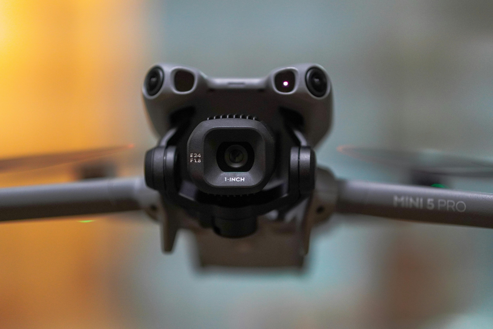

<div align="center">

# 🚀 Thriller  
### A traveler in the infinite dimensions of space and time  


[](https://git.io/typing-svg)

<!-- Animated Badges -->
<p align="center">
  
  
  
  
  
</p>

<!-- Social Links -->
<p align="center" style="animation: fadeIn 3s;">
  <a href="https://www.linkedin.com/in/felix-onsongo-30a9a4301?utm_source=share&utm_campaign=share_via&utm_content=profile&utm_medium=android_app">
    
  </a>
  <a href="mailto:felixmn278@gmail.com">
    
  </a>
  <a href="https://thriller.dev">
    
  </a>
</p>

</div>

---

<!-- ================= ABOUT ME ================= -->
## 👨‍💻 About Me  

[](https://git.io/typing-svg)

✨ Core Strengths (animated badges)  
<p>
  
  
  
  
</p>

---
<!-- GitHub Stats Section -->
## 📊 GitHub Analytics

<div align="center">


</div>

<!-- Skills Matrix -->
## 🛠 Technical Stack

### Programming Languages
<div align="center">

| Language | Proficiency | Use Cases |
|----------|-------------|-----------|
| Python | ⭐⭐⭐⭐⭐ | ML, Backend, Automation |
| JavaScript/TypeScript | ⭐⭐⭐⭐ | Full-Stack Web |
| C++ | ⭐⭐⭐⭐ | Embedded Systems |
| SQL | ⭐⭐⭐ | Database Management |

</div>


<!-- ================= PROJECTS ================= -->
## 🚀 Featured Projects  

### 🔐 Smart Door Recognition System  
[](https://git.io/typing-svg)  

- Tech Stack: Python, OpenCV, TensorFlow, Flask, C++, Arduino  
- Status: 
- Screenshot:

---

### ⚡ Smart Mita (Smart Energy Management App)  
[](https://git.io/typing-svg)  

- Tech Stack: React Native, Firebase, Node.js  
- Status:  
- Screenshot: 

---

### 🌐 Neurostax Website  
[](https://git.io/typing-svg)  

- Tech Stack: React.js, Python, Flask/Django, PostgreSQL  
- Status: live
- Screenshot:   

---

### 🧪 Other Projects  
- 3D design experiments  
- Circuit prototypes  
- Machine learning research (small models & experiments)  

---
]


### Technologies & Frameworks
```mermaid
graph LR
    A[Python] --> B[ML/DL]
    A --> C[Web Backend]
    D[JavaScript] --> E[React]
    D --> F[Node.js]
    G[C++] --> H[Embedded]
    B --> I[Projects]
    C --> I
    E --> I
    F --> I
    H --> I
